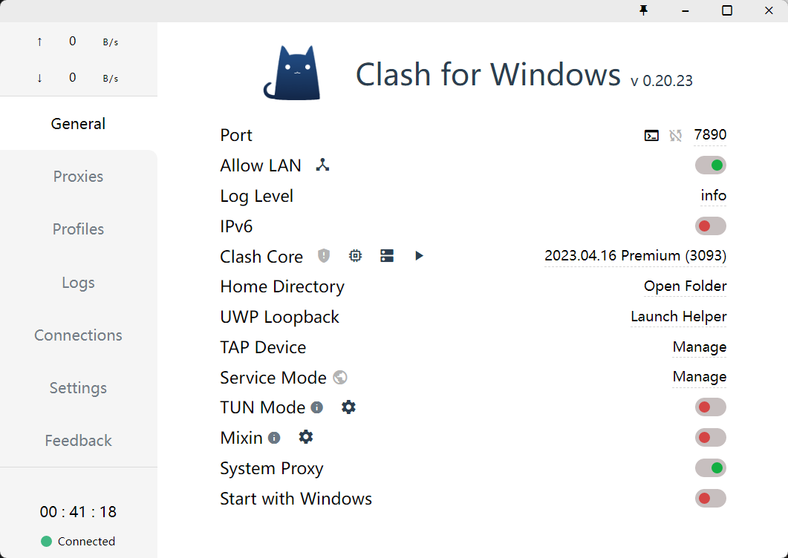

# RustChat - 开发环境与依赖配置（Ubuntu 虚拟机版）

---

## 1. 推荐方案（重要）

本项目推荐使用：

👉 **Ubuntu 虚拟机 + SSH + Windows 开发工具**

优点：

- 接近真实服务器环境
- 避免 Windows 兼容问题
- 可练习部署 & 网络
- 结构更清晰（前后端分离）

---

## 2. Ubuntu 镜像推荐

### 推荐版本

👉 **Ubuntu 22.04 LTS（强烈推荐）**

原因：

- 长期支持（LTS）
- 稳定
- Rust / Node / PostgreSQL 兼容性最好
- 教程最多

---

### 不推荐版本

- 24.04（太新，可能踩坑）
- 20.04（稍老）

---

## 3. 虚拟机配置建议

最低配置（能跑）：

- CPU：2 核
- 内存：4 GB
- 磁盘：30 GB

推荐配置（更流畅）：

- CPU：4 核
- 内存：8 GB
- 磁盘：50 GB+

---

## 4. 虚拟机软件选择

推荐：

- VMware Workstation

---

## 5. Ubuntu 环境配置

### 1. Ubuntu 镜像下载

官方下载地址：

https://ubuntu.com/download/desktop

Ctrl + F：搜索 releases 找到 Ubuntu Server 版本的 .torrent 下载（BT）。

> Ubuntu Server + Windows + VSCode Remote SSH ，所以不需要 GUI 。

### 2. 镜像安装

网络配置选 NAT + DHCP 即可。

最重要的是这个：

```text
☑ Install OpenSSH server
```

### 3. SSH连接

拿到 ip ：

```bash
ip a
```

然后自己测一下 ping 。OK 后再在 VSCode 的 Remote SSH 里面配置：

```text
ssh username@IP
```

### 4. 换镜像源

1️⃣ 备份原源

```bash
sudo cp /etc/apt/sources.list /etc/apt/sources.list.bak
```

2️⃣ 编辑源文件

```bash
sudo nano /etc/apt/sources.list
```

👉 清空内容（Ctrl + K 连按）

👉 替换为（Ubuntu 22.04）：

```bash
deb https://mirrors.aliyun.com/ubuntu/ jammy main restricted universe multiverse
deb https://mirrors.aliyun.com/ubuntu/ jammy-security main restricted universe multiverse
deb https://mirrors.aliyun.com/ubuntu/ jammy-updates main restricted universe multiverse
deb https://mirrors.aliyun.com/ubuntu/ jammy-backports main restricted universe multiverse

deb-src https://mirrors.aliyun.com/ubuntu/ jammy main restricted universe multiverse
deb-src https://mirrors.aliyun.com/ubuntu/ jammy-security main restricted universe multiverse
deb-src https://mirrors.aliyun.com/ubuntu/ jammy-updates main restricted universe multiverse
deb-src https://mirrors.aliyun.com/ubuntu/ jammy-backports main restricted universe multiverse
```

3️⃣ 更新软件源

```bash
sudo apt update
```

4️⃣ 升级系统

```bash
sudo apt upgrade -y
```

5️⃣ 验证是否成功

```bash
apt policy
```

👉 看到：

```text
mirrors.aliyun.com
```

### 5. 安装基础开发工具

```bash
sudo apt install -y build-essential curl git
```

---

## 6. 安装 Rust

```bash
curl https://sh.rustup.rs -sSf | sh
source $HOME/.cargo/env
```

验证安装：

```bash
rustc --version
cargo --version
```

测试：

```bash
cd ~/rustchat-server/backend
cargo init
cargo run
```

输出：

```text
Hello, world!
```

---

## 7. 安装 Node.js（前端）

推荐用 nvm：

```bash
curl -o- https://raw.githubusercontent.com/nvm-sh/nvm/v0.39.5/install.sh | bash
source ~/.bashrc
nvm install 22
nvm use 22
nvm alias default 22
```

截至现在，Node 官方发布节奏里：

- Node 18 已经 EOL，不建议新项目用。
- Node 22 仍是 LTS，支持到 2027-04-30。
- Node 24 是当前 Active LTS，支持到 2028-04-30。

验证安装：

```bash
node --version
npm --version
```

当前前端计划先使用：

```text
Vue 3 + TypeScript + Vite
```

后续搭建前端时建议在项目根目录创建：

```text
frontend/
```

前端基础依赖建议：

```text
vue-router
pinia
axios
```

虚拟机开发时，Vite dev server 需要监听 `0.0.0.0`，否则 Windows 宿主机浏览器无法访问：

```bash
npm run dev -- --host 0.0.0.0
```

访问地址示例：

```text
http://<虚拟机IP>:5173
```

前端环境变量建议预留：

```text
VITE_API_BASE_URL=http://<虚拟机IP>:3000
VITE_WS_BASE_URL=ws://<虚拟机IP>:3000
```

注意：

- 当前只是环境约定，尚未开始初始化 `frontend/`
- 后端服务仍需要监听 `0.0.0.0:3000`
- 如果虚拟机配置了代理，`localhost`、`127.0.0.1`、虚拟机内网 IP 应加入 `NO_PROXY / no_proxy`

安装依赖与启动命令：

```bash
cd frontend
npm install
npm run dev -- --host 0.0.0.0
```

如需从零手动补齐依赖：

```bash
cd frontend
npm install vue vue-router pinia axios
npm install -D vite typescript @vitejs/plugin-vue vue-tsc
```

---

## 8. 安装 PostgreSQL

```bash
sudo apt update
sudo apt install postgresql postgresql-contrib -y
```

启动：

```bash
sudo service postgresql start
```

开机自启：

```bash
sudo systemctl enable postgresql
```

进入数据库：

```bash
sudo -u postgres psql
```

创建数据库：

```bash
CREATE DATABASE rustchat;

CREATE USER username WITH PASSWORD 'password';

ALTER ROLE username SET client_encoding TO 'utf8';
ALTER ROLE username SET default_transaction_isolation TO 'read committed';
ALTER ROLE username SET timezone TO 'UTC';

GRANT ALL PRIVILEGES ON DATABASE rustchat TO username;

\q
```

测试本机连接：

```bash
psql -h localhost -U username -d rustchat
# 然后输入用户密码
```

修改配置文件，在宿主机连接：

- 修改监听地址

```bash
sudo nano /etc/postgresql/*/main/postgresql.conf
# 找到
#listen_addresses = 'localhost'
# 改成
listen_addresses = '*'
```

- 修改访问控制

```bash
sudo nano /etc/postgresql/*/main/pg_hba.conf
# 在最后加一行加上，仅允许本机连接访问
host    all    all    192.168.0.0/16    md5
```

重启 PostgreSQL：

```bash
sudo service postgresql restart
```

最后拿到虚拟机 ip 就可以在宿主机进行连接。

---

## 12. 运行 RustChat 服务

务必监听：

```rust
0.0.0.0:3000
```

⚠️ 不要用：

```rust
127.0.0.1
```

否则外部访问不到

---

## 13. Postman 测试虚拟机服务

可以直接在 Windows 上测试：

```text
ws://<虚拟机IP>:3000/ws
```

要求：

- 服务监听 0.0.0.0
- 端口开放
- 防火墙允许

---

## 14. 最终开发结构

```text
Windows（开发）
  ↓ SSH
Ubuntu VM（运行）
  ├── backend (Rust)
  ├── frontend (React/Vue)
  └── PostgreSQL
```

---

## 15. VMware虚拟机 proxy 配置

鉴于我们在使用虚拟机时常常会因为网络问题无法访问：github.com 等网站，或者就是 npm 等包，curl 无法访问外网。而本项目选择使用 SSH 连接虚拟机进行开发，就必须要让虚拟机能够访问外网，这里给出在代理工具 Clash 的配置方法。

### 1. 不采用 TUN 的手动配置



找到 Port ，把更新关掉。
打开 Allow LAN ，点击三角图标，记住 WLAN 的 ip 地址。后面用 NAT 共享这个 ip 进行转发。
查看 Profiles 的配置 .yalm 文件看是否 `allow-lan = true` ;

---

VMware 选择 NAT 连接。
在终端输入：

```bash
sudo nano /etc/environment
```

把下面配置写入

```text
# 不要带引号和空格
https_proxy=http://your_ip_address:port
HTTPS_PROXY=http://your_ip_address:port
HTTP_PROXY=http://your_ip_address:port
http_proxy=http://your_ip_address:port

# 在行前 backspace 后不要出现
HTTP_PROXY=http://your_ip_address:port HTTPS_PROXY=http://your_ip_address:port
```

然后退出当前窗口，重新登录

```bash
exit
```

执行下面代码查看代理

```bash
env | grep -i proxy
```

成功会输出刚才写入的内容。
最后测试一下 github.com

```bash
curl -I https://github.com
```

### 补充：

将下列写入 `/etc/environment` ，让本机和虚拟机内网地址不走代理。这样在测试后端 api 的时候不会走代理而导致失败。

```bash
NO_PROXY=127.0.0.1,localhost,192.168.221.131
no_proxy=127.0.0.1,localhost,192.168.221.131
```

配置代理后测试

```bash
cargo run
curl -v http://127.0.0.1:3000/health
```

输出： ip 是随便写的。

```text
rabbit@rustchat-server:~/rustchat-server$ curl -v http://127.0.0.1:3000/health
* Uses proxy env variable http_proxy == 'http://172.21.71.1:7890'
*   Trying 172.21.71.1:7890...
* Connected to (nil) (172.21.71.1) port 7890 (#0)
> GET http://127.0.0.1:3000/health HTTP/1.1
> Host: 127.0.0.1:3000
> User-Agent: curl/7.81.0
> Accept: */*
> Proxy-Connection: Keep-Alive
>
* Mark bundle as not supporting multiuse
< HTTP/1.1 502 Bad Gateway
< Connection: keep-alive
< Keep-Alive: timeout=4
< Proxy-Connection: keep-alive
< Content-Length: 0
<
* Connection #0 to host (nil) left intact
```

不走代理

```text
rabbit@rustchat-server:~$ curl -v http://127.0.0.1:3000/health
* Uses proxy env variable no_proxy == '127.0.0.1,localhost,192.168.221.131'
*   Trying 127.0.0.1:3000...
* Connected to 127.0.0.1 (127.0.0.1) port 3000 (#0)
> GET /health HTTP/1.1
> Host: 127.0.0.1:3000
> User-Agent: curl/7.81.0
> Accept: */*
>
* Mark bundle as not supporting multiuse
< HTTP/1.1 200 OK
< content-type: application/json
< content-length: 66
< date: Thu, 23 Apr 2026 15:02:46 GMT
<
* Connection #0 to host 127.0.0.1 left intact
{"code":200,"message":"service is healthy","data":{"status":"ok"}}
```
